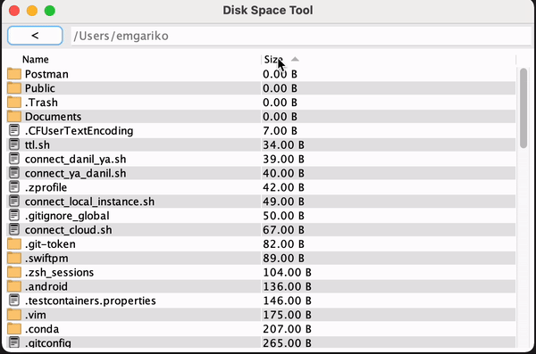
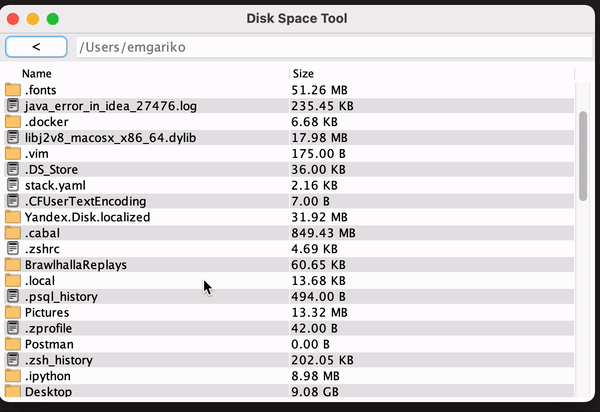
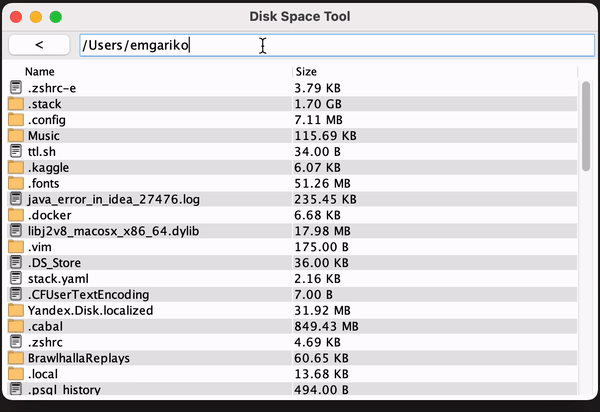
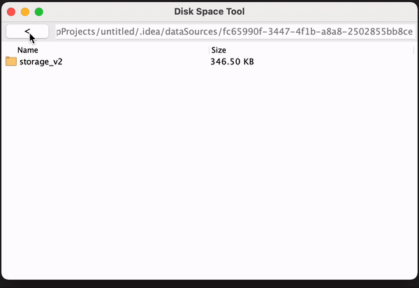
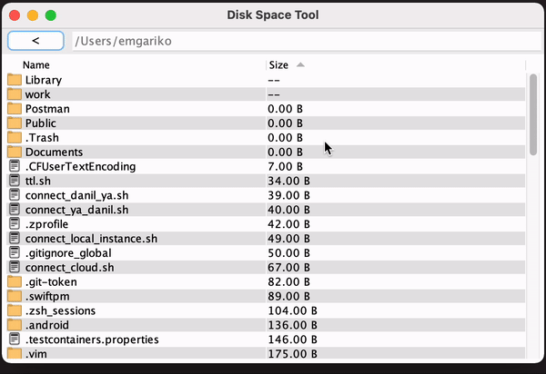

# Disk Space Tool

A user-friendly disk space profiler with a graphical user interface (GUI) that allows navigation through the file system.

---

## How to run
1. Clone the repository
2. Open the project in IntelliJ IDEA
3. Run the `main` method in [AppFrame.java](/src/com/emgariko/diskspacetool/AppFrame.java)

## Supported features
- [x] Sorting by name/size
  - 
- [x] Navigation through directories (mouse click, Enter(go to selected directory) or backspace(go to parent directory) keys)
  - 
- [x] Path input
  -  
- [x] Go to parent directory button
  -  
- [x] Sizes of directories asynchronously calculated and cells get updated when calculation is finished
  - 

## About
Java 17 and Swing are used for development.

I use `JTable` with custom Model to display the list of directories and their sizes.
The [AppFrame.java](/src/com/emgariko/diskspacetool/AppFrame.java) class stores the state of the application in private variables.
It stores current directory using `java.nio.file.Path` and current Table's Model which stores the data. The state is updated,
and the table is re-rendered when the user interacts with the application via button, input field or click on a directory.

To calculate the sizes of directories in the current directory (as shown in the table), I use the [BackgroundTask.java](/src/com/emgariko/diskspacetool/BackgroundTask.java) for each directory.
File sizes are immediately obtained via `Files.readAttributes(path, BasicFileAttributes.class).getSize()`. The `BackgroundTask` is a
`SwingWorker` that calculates the directory size asynchronously and updates the corresponding cell in the table when the calculation is complete. 
The calculation is performed using `Files.walkFileTree(path, fileVisitor)`.
When the state is updated, and the table's data is re-rendered, all previously launched BackgroundTasks get cancelled.
